# Proof of Innocence Arb

Mixers are popular protocols on blockchains allows users to make private transactions by breaking the on-chain link between the recipient and destination addresses. The most used mixer Tornado Cash got sanctioned by OFAC in August 2022 for the reasons that it has been used to launder money. After the sanction we came up with the idea [proof of innocence](https://github.com/chainwayxyz/proof-of-innocence). 

Proof of Innocence is a tool that allows users to prove that their withdrawals from Tornado Cash are not from a list of specified deposits, selected by the user themselves. This allows users to clear their name and demonstrate their innocence without revealing their identity.

Now we further developed the Proof of Innocence to support arbitrary amount of deposits and withdrawals: **Proof of Innocence Arb**.

## How Tornado Cash Works

Tornado.Cash implements an Ethereum zero-knowledge privacy solution: a smart contract that accepts transactions in Ether so that the amount can be later withdrawn with no reference to the original transaction.

Every deposit generates a new leaf in the merkle tree.
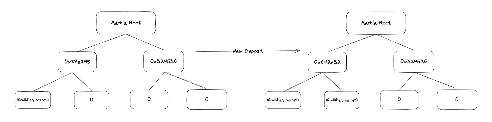

When withdrawing, user provides a zk proof that they are in the merkle tree without revealing their identity. Then smart contract adds the nullifier to a mapping to prevent double spending.
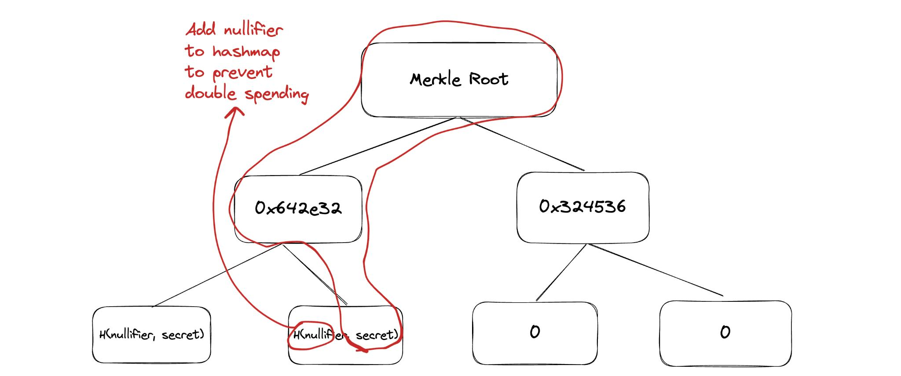

The issue is you share the same anonimity set with hackers or sanctioned addresses.
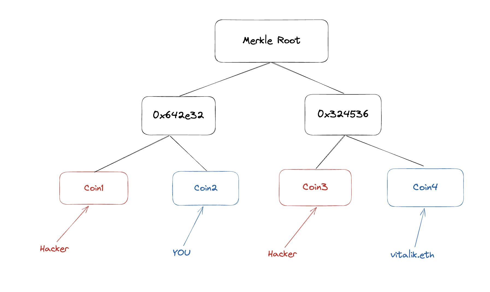

To solve this issue we created [proof of innocence](https://github.com/chainwayxyz/proof-of-innocence) where you can prove that you are not in a list of deposits.
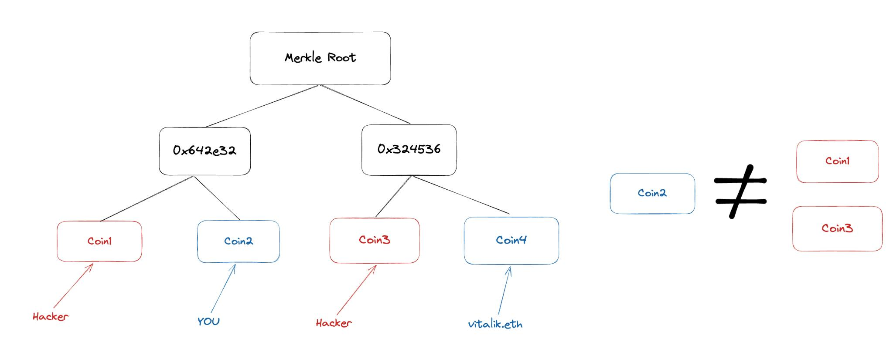

## Better Privacy Protocols

Tornado Cash only supports fixed amount of deposit and withdrawals. But some privacy protocols like Tornado Nova or Railgun supports transactions with arbitrary amounts.

To support arbitrary amounts, new join split transaction is added.
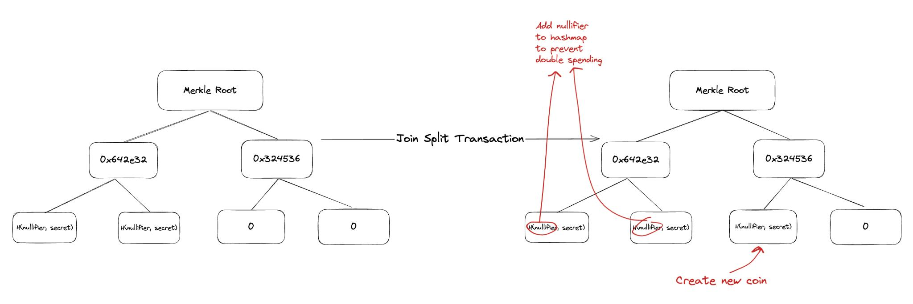

Making proof of innocence on this kind of protocols are hard because transactions are now directed acylic graphs.
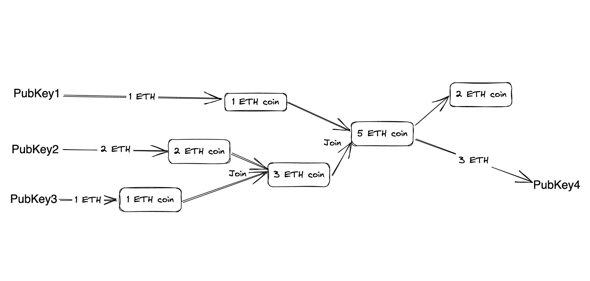

To generate a proof of innocence we first flatten the transactions.

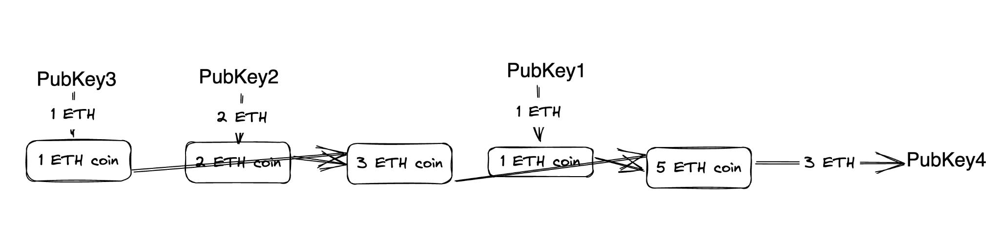

Then for every transaction we prove our step function which looks like this:
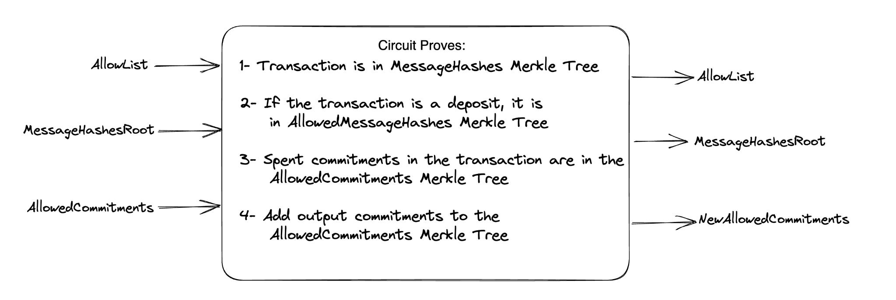
Whole code for the step function can be found here: [proofOfInnocence.circom](circuits/proofOfInnocence.circom)

Now we have a proof for every step that we can fold with [Nova Folding Scheme](https://eprint.iacr.org/2021/370).
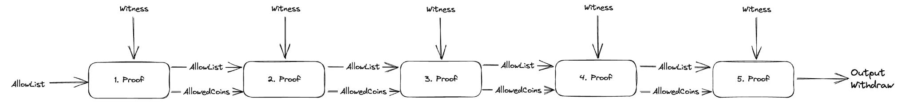
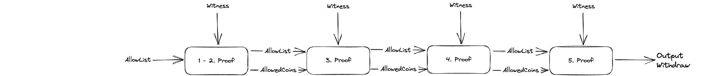
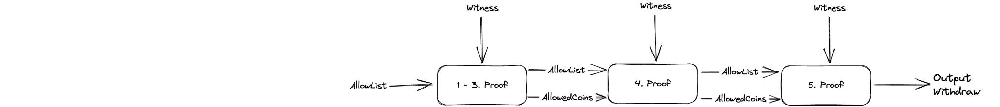
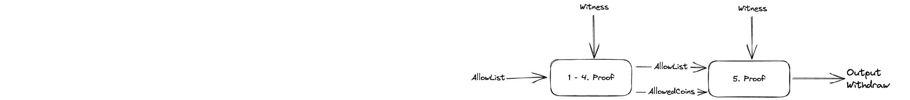
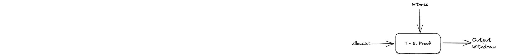

After folding compressing the witness makes it ZK-SNARK
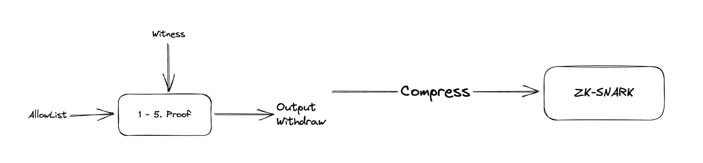

## TODO:

- UI for the privacy pool
- Generating a succint proof of innocence on browser using [Nova Scotia](https://github.com/nalinbhardwaj/Nova-Scotia)
- Add shielded transactions
- Change nullifier architecture to increase security

## Last Words

Please note that the use of Proof of Innocence Arb is at your own risk. Chainway values the importance of open source projects and welcomes any feedback on Proof of Innocence Arb.

